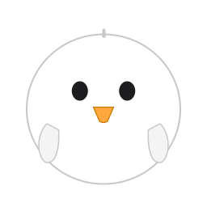

# Chick

A tiny baby-chick critter that lives on your Mac desktop.



## Features

- 🐤 **Wandering chicks** that idle, walk, talk to each other, and flee from your cursor
- 🎨 **Seven visual styles** swappable from the menu bar: Anime, Realistic, Memoji, Lego, Embroidered Felt, Oil Painting, PSX Low-Poly
- 🏠 **Draggable chicken coop** — click it to spawn coloured chick friends; they wander in and out on their own
- 🎵 **Procedurally synthesised voices** — 22 chirps generated from real bioacoustic ranges (no recordings)
- ⚡ **Practically free** — idle CPU is 0 %, active animation around 1–3 % on a single core
- 🖥️ **Multi-monitor aware** — chicks correctly walk across screen boundaries, never wander into the void
- 🌒 **Below or above app windows** — toggle from the menu


## Install

Download `Chick.zip` from [the latest release](../../releases/latest) (or [the website](https://sagistiki.github.io/chick)), unzip, drag `Chick.app` into `~/Applications`.

The app is unsigned (just an ad-hoc signature — no $99/yr Apple Developer ID), so macOS quarantines it on download and reports it as "damaged". Strip the quarantine flag once:

```bash
xattr -cr ~/Applications/Chick.app
```

Then double-click the app. (Alternative: right-click → Open → Open in the dialog.)

A 🐤 icon appears in the menu bar with all controls.

## Build from source

```bash
git clone https://github.com/sagistiki/chick.git
cd chick
./build.sh
open Chick.app
```

Requirements: macOS 13+ and Xcode command-line tools (`xcode-select --install`).

## Project layout

```
chick/
├── main.swift                    # the entire app (~1 kloc, intentional)
├── build.sh                      # compile + bundle + copy assets
├── package.sh                    # build + zip + stage docs/ for Pages
├── render_icon.swift             # tiny SVG → PNG renderer used at build time
├── icon.svg                      # app icon (rasterised to .icns)
├── island.svg                    # pixel-art chicken island widget
├── chick_<style>.png             # 7 spritesheets, 256×64 each
├── new-chicks/                   # AI source images used to derive the spritesheets (compressed)
├── process_all_chicks.py         # batch crop + transparent-background pipeline
├── compress_sources.py           # halves source dims + PNG-optimises new-chicks/
├── generate_sounds.py            # 22 chick chirp .wav files
├── generate_moo_sounds.py        # 10 cow moo .wav files
├── sounds/                       # generated audio
└── docs/                         # GitHub Pages site (download landing page)
```

## How the sounds work

Chick chirps are produced via additive synthesis grounded in published bioacoustic research — two "voices" mixed together to mimic the avian *syrinx* (which has two independent sources). Each voice has its own F0 sweep, harmonic stack, jitter, and shimmer. Sharp 2–5 ms attacks, dynamic harmonic decay during release. Frequency targets cover the standard neonatal *Gallus gallus* call classes (pleasure / distress / warble / short peep, ~2.5–5 kHz).

See the docstring in `generate_sounds.py` for citations.

A matching cow-moo synthesiser (`generate_moo_sounds.py`) is included for a future cow companion — currently dormant.

## Credits

- Sprite references for the seven chick styles generated with **Nano Banana 2** (Google's image generation model) and post-processed in this repo (`process_all_chicks.py` → 256×64 spritesheets with transparent backgrounds).
- Swift code, sound synthesis pipeline, SVGs, and build tooling written with **Claude Opus 4.7 Max**.

## License

MIT.
